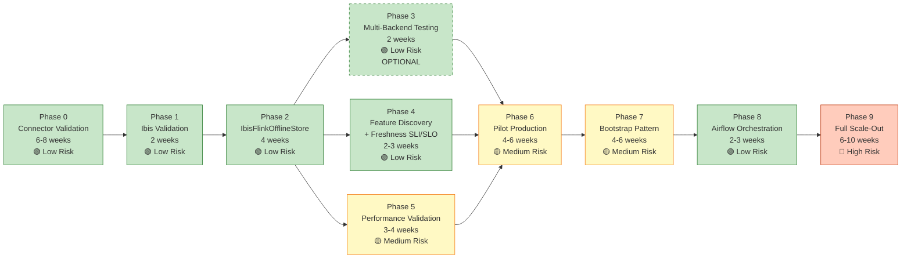
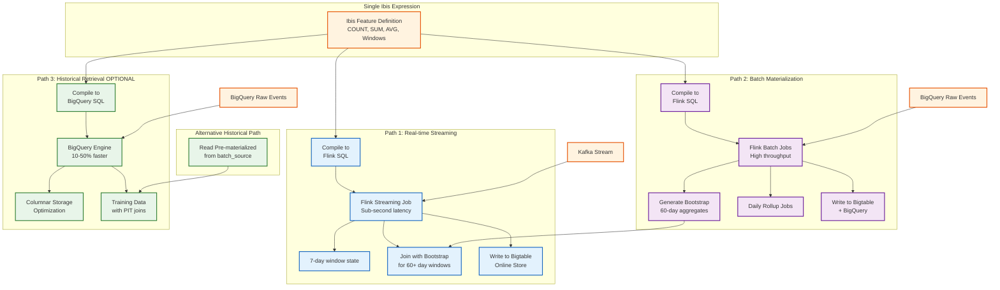
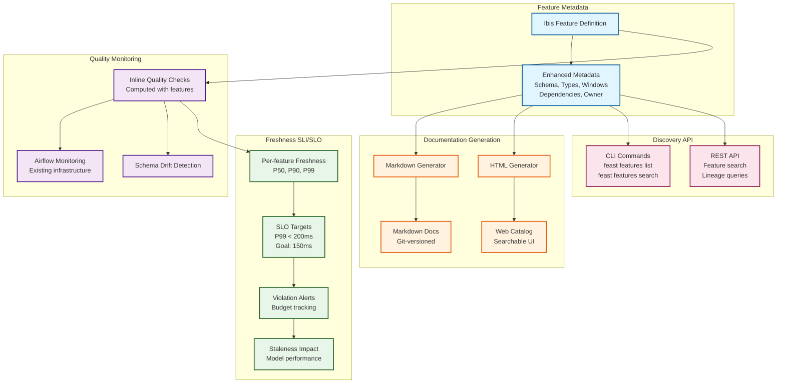
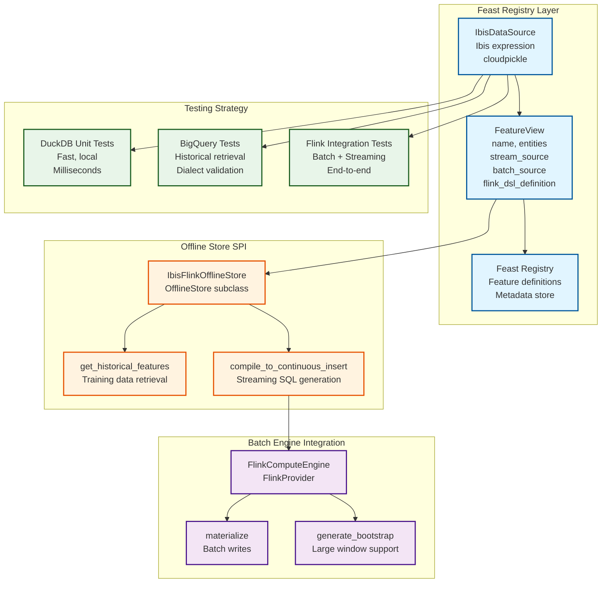
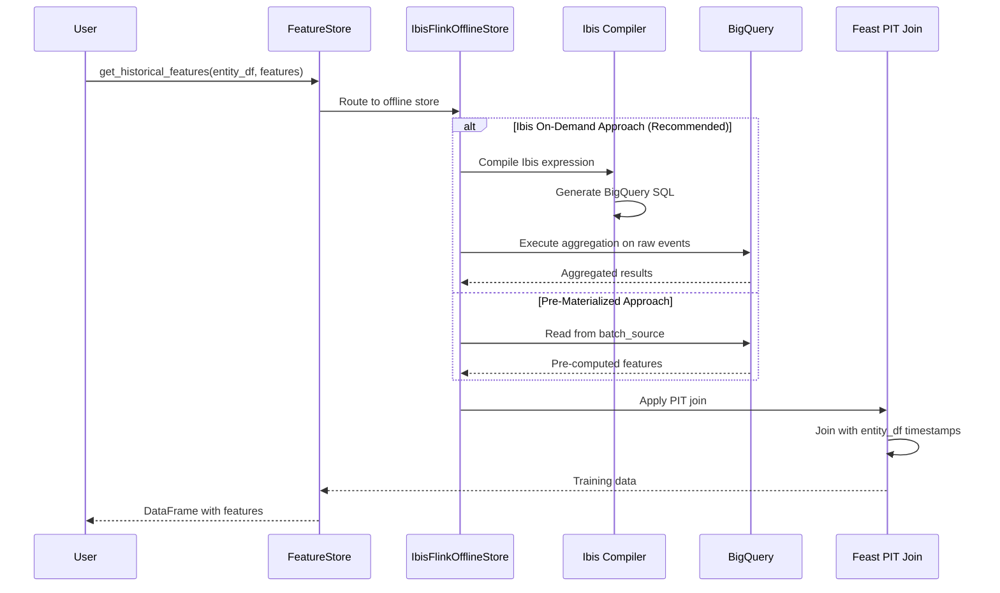
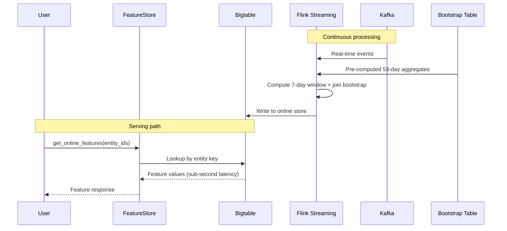
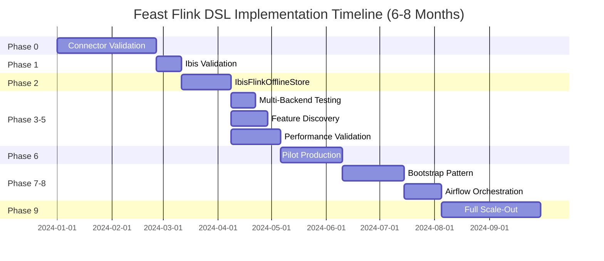

# Feast Flink DSL Implementation - Architecture Diagrams

This document contains comprehensive Mermaid diagrams that capture the complete architecture, phases, and component interconnections from the Feast Flink DSL Implementation plan.

## Complete System Architecture

```mermaid
graph TB
    subgraph "Feature Definition Layer"
        FD[Ibis Feature Definitions<br/>Single Source of Truth]
        BC[Bootstrap Config<br/>Large Windows 60+ days]
        FD --> BC
    end

    subgraph "Data Sources"
        KAFKA[Kafka Streams<br/>Real-time Events]
        BQ_RAW[BigQuery<br/>Raw Events]
        BOOTSTRAP[Bootstrap Tables<br/>Pre-aggregated 60d]
    end

    subgraph "Feast Core Components"
        IDS[IbisDataSource<br/>cloudpickle serialization]
        IFOS[IbisFlinkOfflineStore<br/>OfflineStore SPI]
        FV[FeatureView<br/>Registry]
        FS[FeatureStore API<br/>get_historical_features<br/>get_online_features]
    end

    subgraph "Compilation Layer"
        IC[Ibis Compiler<br/>Multi-dialect]
        FLINK_SQL[Flink SQL<br/>Streaming + Batch]
        BQ_SQL[BigQuery SQL<br/>Historical]
        DUCK_SQL[DuckDB SQL<br/>Testing]
    end

    subgraph "Execution Engines"
        subgraph "Path 1: Real-time"
            FLINK_STREAM[Flink Streaming<br/>Sub-second latency<br/>7-day state]
        end

        subgraph "Path 2: Batch"
            FCE[FlinkComputeEngine<br/>Materialization]
            FLINK_BATCH[Flink Batch Jobs<br/>Bootstrap + Rollups]
        end

        subgraph "Path 3: Historical"
            BQ_ENGINE[BigQuery Engine<br/>10-50% faster<br/>Columnar storage]
        end
    end

    subgraph "Storage Layer"
        BIGTABLE[Bigtable<br/>Online Store<br/>Low-latency serving]
        BQ_MAT[BigQuery<br/>Materialized Features<br/>batch_source]
        BQ_HIST[BigQuery<br/>Historical Training Data]
    end

    subgraph "Orchestration"
        AIRFLOW[Airflow DAGs<br/>Auto-generated]
        ROLLUP[Daily Rollup Jobs]
        MONITOR[Monitoring<br/>5-min checks]
        CONSIST[Consistency Checks<br/>Hourly]
        FRESH[Freshness SLI/SLO<br/>P99 < 200ms]
    end

    subgraph "Monitoring & Discovery"
        CATALOG[Feature Catalog<br/>Web UI + CLI]
        DOCS[Auto-generated Docs<br/>Markdown + HTML]
        QUALITY[Quality Metrics<br/>Drift Detection]
    end

    %% Feature Definition Flow
    FD --> IDS
    IDS --> FV
    FV --> IFOS
    IFOS --> FS

    %% Compilation Paths
    FD --> IC
    IC --> FLINK_SQL
    IC --> BQ_SQL
    IC --> DUCK_SQL

    %% Path 1: Streaming
    KAFKA --> FLINK_STREAM
    BOOTSTRAP --> FLINK_STREAM
    FLINK_SQL --> FLINK_STREAM
    FLINK_STREAM --> BIGTABLE

    %% Path 2: Batch Materialization
    BQ_RAW --> FCE
    FLINK_SQL --> FLINK_BATCH
    FCE --> FLINK_BATCH
    FLINK_BATCH --> BIGTABLE
    FLINK_BATCH --> BQ_MAT
    FLINK_BATCH --> BOOTSTRAP

    %% Path 3: Historical Retrieval
    BQ_RAW --> BQ_ENGINE
    BQ_SQL --> BQ_ENGINE
    BQ_ENGINE --> BQ_HIST
    BQ_HIST --> FS

    %% Alternative Historical Path
    BQ_MAT --> FS

    %% Orchestration Connections
    AIRFLOW --> ROLLUP
    AIRFLOW --> MONITOR
    AIRFLOW --> CONSIST
    ROLLUP --> BOOTSTRAP
    MONITOR --> FLINK_STREAM
    CONSIST --> BIGTABLE
    FRESH --> MONITOR

    %% Discovery & Monitoring
    FV --> CATALOG
    FV --> DOCS
    FLINK_STREAM --> QUALITY
    QUALITY --> FRESH

    %% User Interactions
    FS --> BIGTABLE
    FS --> BQ_HIST

    classDef definition fill:#e1f5ff,stroke:#01579b,stroke-width:2px
    classDef compilation fill:#fff3e0,stroke:#e65100,stroke-width:2px
    classDef execution fill:#f3e5f5,stroke:#4a148c,stroke-width:2px
    classDef storage fill:#e8f5e9,stroke:#1b5e20,stroke-width:2px
    classDef orchestration fill:#fff9c4,stroke:#f57f17,stroke-width:2px
    classDef monitoring fill:#fce4ec,stroke:#880e4f,stroke-width:2px

    class FD,BC,IDS definition
    class IC,FLINK_SQL,BQ_SQL,DUCK_SQL compilation
    class FLINK_STREAM,FCE,FLINK_BATCH,BQ_ENGINE execution
    class BIGTABLE,BQ_MAT,BQ_HIST,BOOTSTRAP storage
    class AIRFLOW,ROLLUP,MONITOR,CONSIST,FRESH orchestration
    class CATALOG,DOCS,QUALITY monitoring
```



## Implementation Phase Dependencies



**Legend:**
- 🟢 Green (Low Risk): Foundational work, no production impact
- 🟡 Yellow (Medium Risk): Some risk but mitigated
- 🔴 Red (High Risk): Significant production deployment
- Dashed border: Optional phase (can be skipped)

## Three Execution Paths Detail



**Key Points:**
- **Path 1**: Real-time serving with sub-second latency (Kafka → Flink → Bigtable)
- **Path 2**: Batch materialization and bootstrap generation (BigQuery → Flink → Bigtable)
- **Path 3**: Historical retrieval for training data (BigQuery → BigQuery Engine → Training Data)
- All three paths share the same Ibis feature definition (single source of truth)

## Bootstrap Pattern for Large Windows

```mermaid
graph TB
    subgraph "Without Bootstrap - State Explosion"
        WO_STATE[60-day Window State<br/>❌ 8.6x larger state<br/>❌ Slower recovery<br/>❌ Higher memory]
    end

    subgraph "With Bootstrap Pattern"
        BOOT_TABLE[Bootstrap Table<br/>Pre-computed 53 days<br/>Updated Daily]
        STREAM_STATE[7-day Stream State<br/>✅ 90% smaller<br/>✅ Fast recovery<br/>✅ Low memory]
        COMBINE[Combine Aggregates<br/>bootstrap[53d] + stream[7d]<br/>= total[60d]]

        BOOT_TABLE --> COMBINE
        STREAM_STATE --> COMBINE
    end

    subgraph "Bootstrap Lifecycle"
        DAILY[Daily Airflow DAG]
        FLINK_JOB[Flink Batch Job<br/>Compute 53-day rollup]
        WRITE_BQ[Write to BigQuery<br/>Bootstrap table]
        STREAM_READ[Streaming Job Reads<br/>Latest bootstrap]

        DAILY --> FLINK_JOB
        FLINK_JOB --> WRITE_BQ
        WRITE_BQ --> BOOT_TABLE
        BOOT_TABLE --> STREAM_READ
        STREAM_READ --> COMBINE
    end

    RAW[Raw Events<br/>BigQuery] --> FLINK_JOB

    style WO_STATE fill:#ffcdd2,stroke:#c62828,stroke-width:2px
    style BOOT_TABLE fill:#c8e6c9,stroke:#2e7d32,stroke-width:2px
    style STREAM_STATE fill:#c8e6c9,stroke:#2e7d32,stroke-width:2px
    style COMBINE fill:#fff9c4,stroke:#f57f17,stroke-width:2px
```

**Benefits:**
- 90% reduction in streaming state size
- Faster job recovery and restarts
- Lower memory consumption
- Efficient handling of 60+ day windows

## Feature Discovery & Monitoring System



**Features:**
- Auto-generated documentation from Ibis definitions
- Searchable feature catalog with web UI
- Inline quality metrics (computed with features)
- Freshness SLI/SLO tracking (P99 < 200ms target)
- Schema drift detection
- CLI and REST API for discovery

## Key Component Relationships



**Integration Points:**
- **IbisDataSource**: Wraps Ibis expressions with cloudpickle serialization for Feast registry
- **IbisFlinkOfflineStore**: Standard OfflineStore SPI implementation (~800 lines)
- **FlinkComputeEngine**: Handles materialization and bootstrap generation
- **Multi-tier Testing**: DuckDB (fast unit tests) → BigQuery (dialect validation) → Flink (end-to-end)

## Data Flow: Historical Retrieval



## Data Flow: Real-time Serving




## Timeline Overview



## Summary

These diagrams capture the complete Feast Flink DSL implementation architecture:

1. **System Architecture**: All components and their interactions
2. **Phase Dependencies**: 9 phases over 6-8 months with risk assessment
3. **Execution Paths**: Three paths from single Ibis definition (streaming, batch, historical)
4. **Bootstrap Pattern**: 90% state reduction for large windows
5. **Feature Discovery**: Auto-documentation, quality monitoring, freshness SLI/SLO
6. **Component Relationships**: Feast integration via standard SPI patterns
7. **Data Flows**: Sequence diagrams for historical retrieval and real-time serving
8. **Ibis vs Custom DSL**: 78% code reduction, 33-43% faster timeline

**Key Innovation**: Leverage mature Ibis library instead of building custom DSL, reducing complexity and timeline while gaining multi-backend support.

